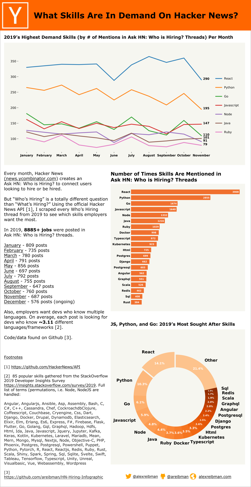

Recap of HN's Most In-Demand Skills of 2019.

Data gathered from 8885 posts in Ask HN: Who is Hiring? threads on Hacker News (news.ycombinator.com).

Full code and data can be found at: https://github.com/areibman/HN-Hiring-Infographic/

Made with Python (pandas, matplotlib) and Figma

Code used to gather and generate the data for the HN 2019 Who Is Hiring infographic.

### Data:
* Raw counts of every word - `word_counts.json`. This is a Counter object that contains the raw word counts of every post from each month. So, for example, if the post said: "Google wants python devs", the object reads: ("Google":1, "wants":1...).
* Skill counts - `skill_data.csv`

To run: 

`jupyter notebook` and run each cell sequentially.

